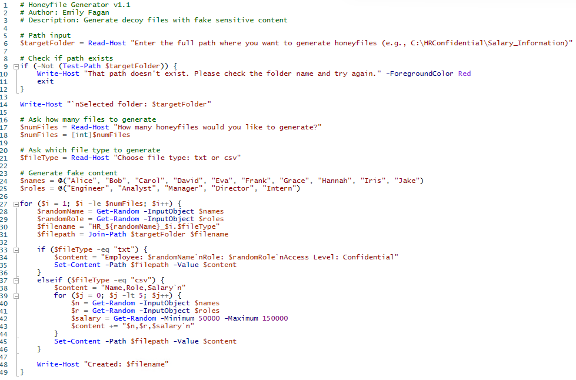

# Part 1 of the Honeytoken System: File Generator

While learning about honeytoken systems, I ran into a problem: manually creating a bunch of realistic decoy documents was tedious and repetitive. So, I wrote a PowerShell script to automate it. That’s what scripting is for, right?     

This marks Part 1 of my multi-phase honeytoken project, where I focus on building realistic decoy files for use in a Windows domain environment (`fagan.local`).         

### Base Generator Code

     

I started by generating two types of files — .csv and .txt — to test how the script should behave. The first version allowed me to choose how many files to create and the type of file I wanted. Here's the result from my first test run:     

3 `.csv` files generated:      

         

4 `.txt` files generated:      

         

### Script Modifications

I iterated on the script to include more advanced features:     
- Ability to add multiple entries per file
- Randomized timestamps (creation, modification, and access time)
- Custom file names, prompted at runtime      

This makes each decoy more believable and better simulates how real organizations might store sensitive HR documents.      

Here’s the updated script in PowerShell:          

      

Generated honeyfile output:       

     

### Timestamp Editor Script

To support additional realism, I also created a second script — [Set-Timestamps.ps1](./Set-Timestamps.ps1) — that lets an admin manually change the creation, modification, and access timestamps on any file.       

It prompts the user for:       
- Full path to the file
- Desired date
- Desired time

This lets me fine-tune the timestamps of previously created files to better blend into the environment:        

     

### [Part 2: File Access Logging](./file-access-logging/README.md)     

In Part 2, I configure Windows file system auditing to detect when these honeyfiles are accessed. This will turn the decoy documents into functional intrusion detection triggers inside my Active Directory lab.         
